# Gaming Dashboard

Touch-first LAN dashboard for a Windows gaming PC, built for phones and tablets in landscape.

It combines:
- live temps, network, audio, Spotify, Discord, and process data
- a richer `Studio` client for layout/theme editing
- a dependency-light `Vanilla` client as the fallback
- a hosted Discord relay so the bot token stays off the gaming PC

## Preview

### Studio

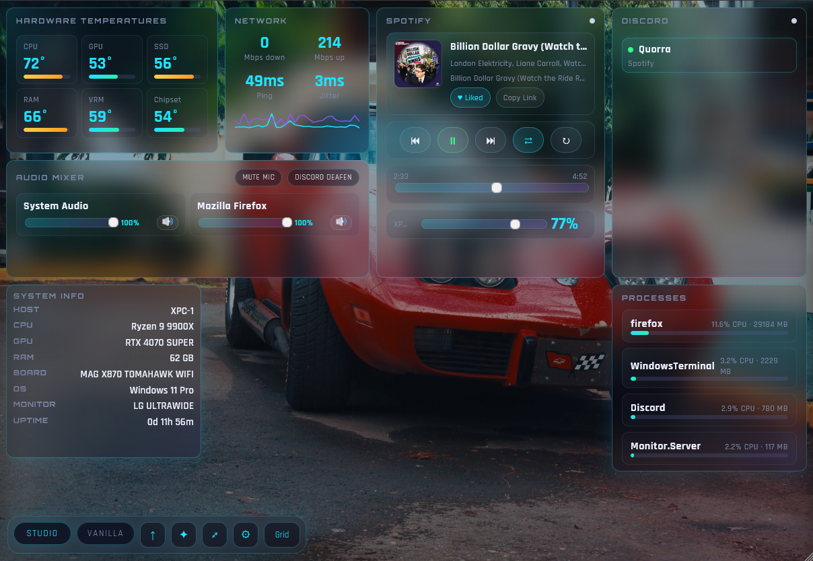

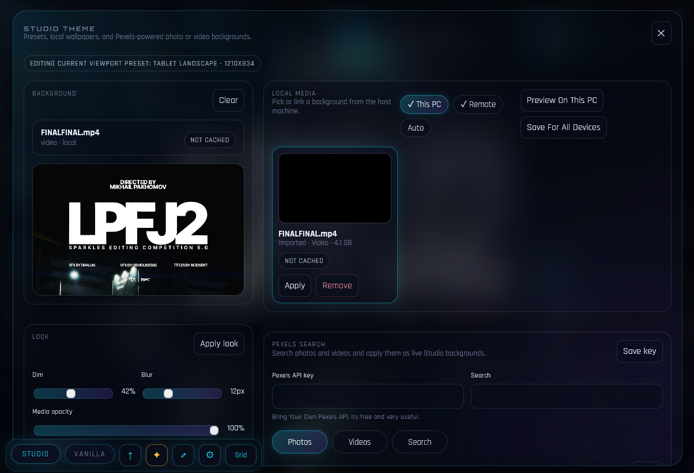

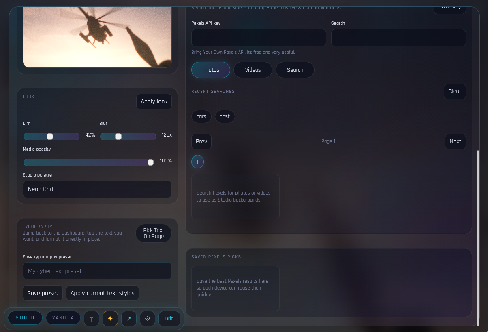

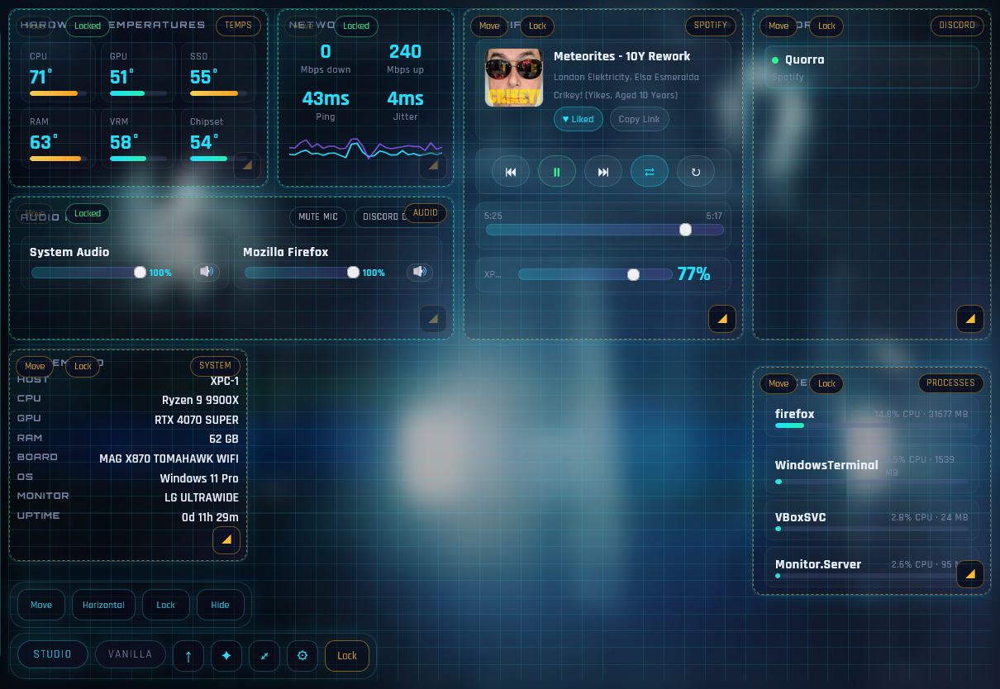

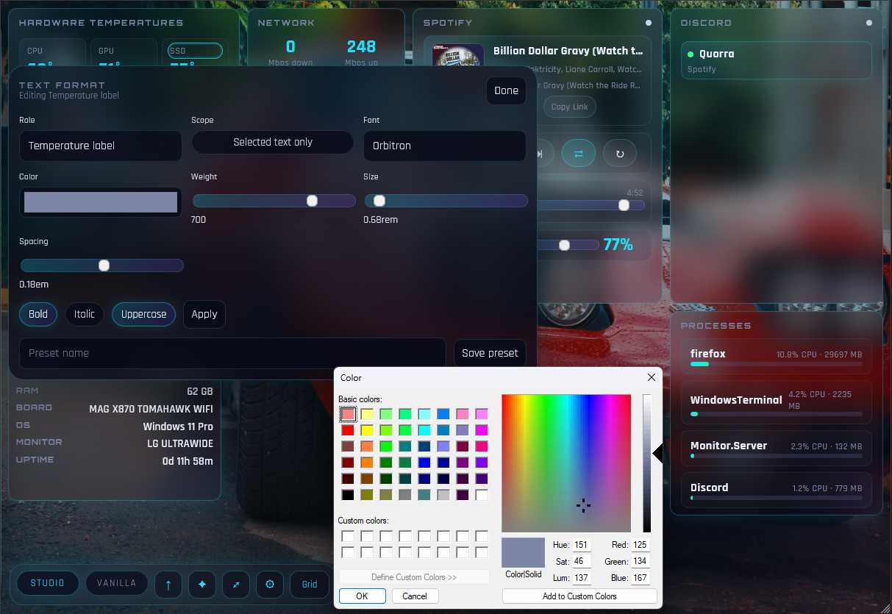


### Theme And Media

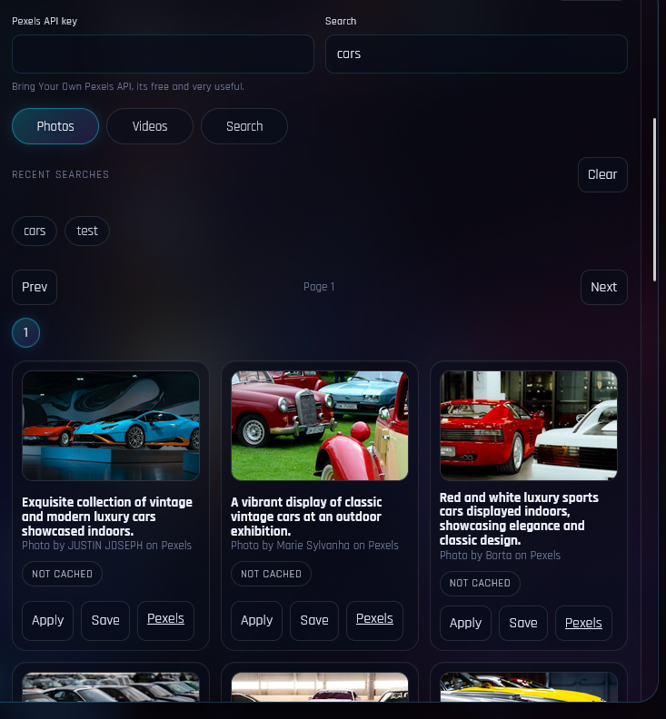

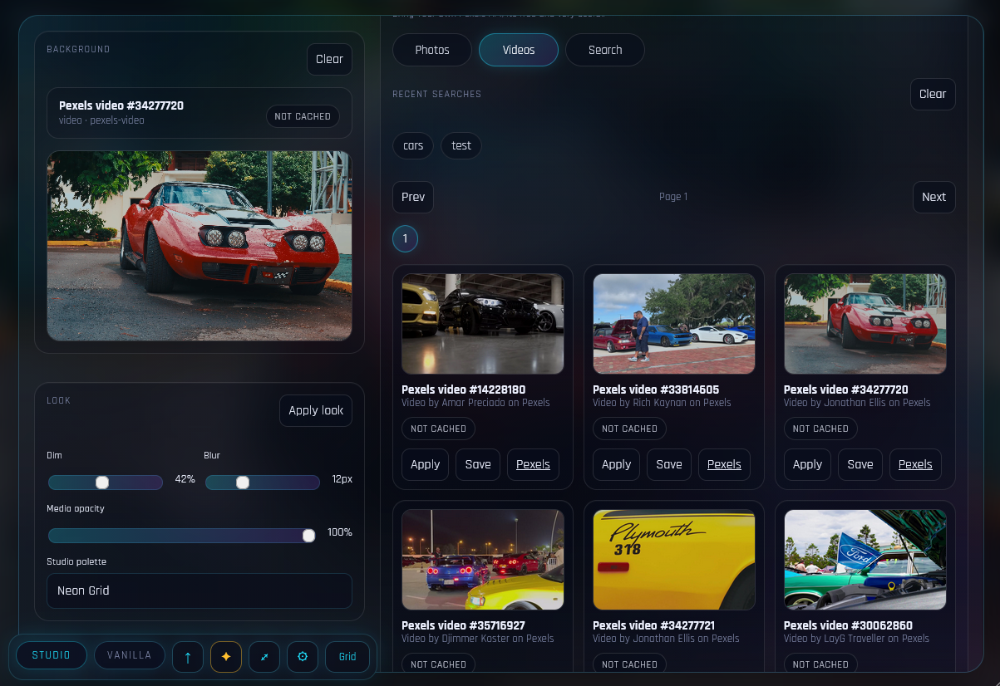

### Settings

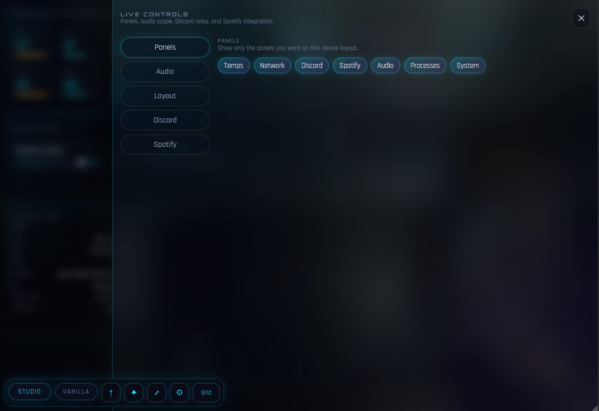

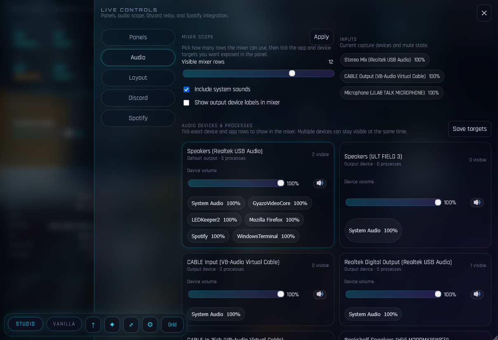

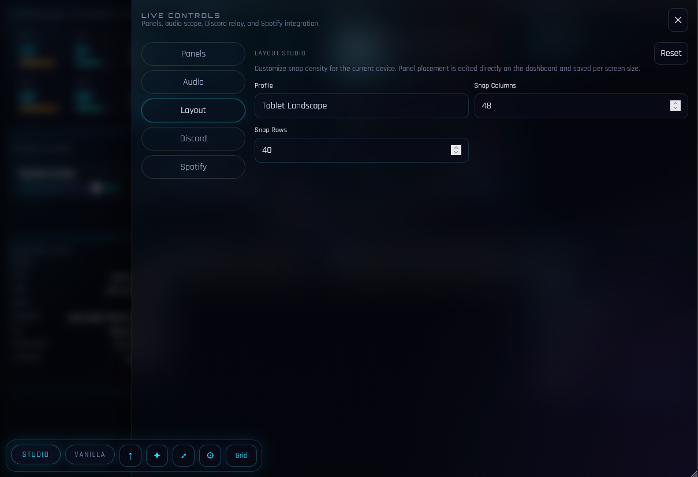

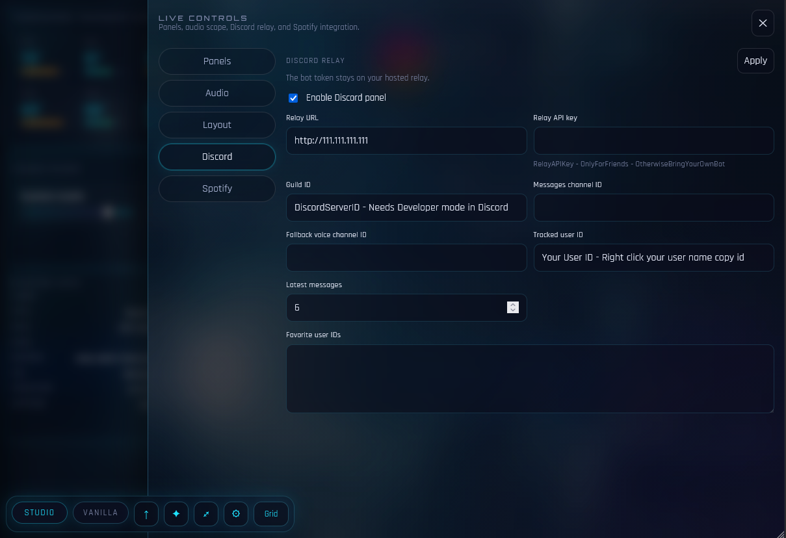

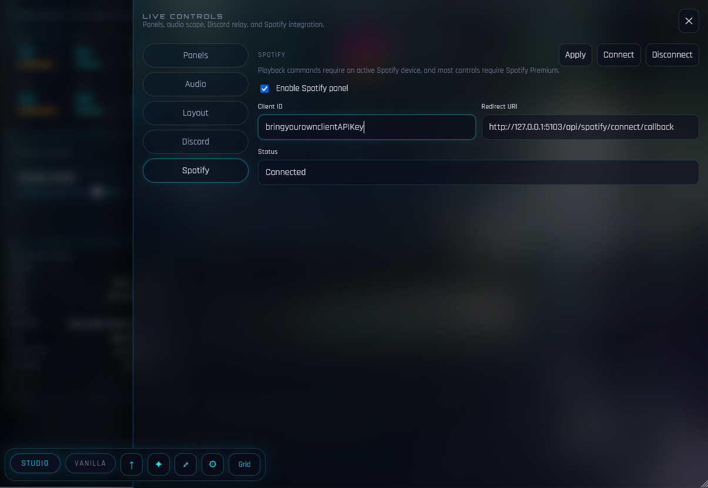

### Vanilla

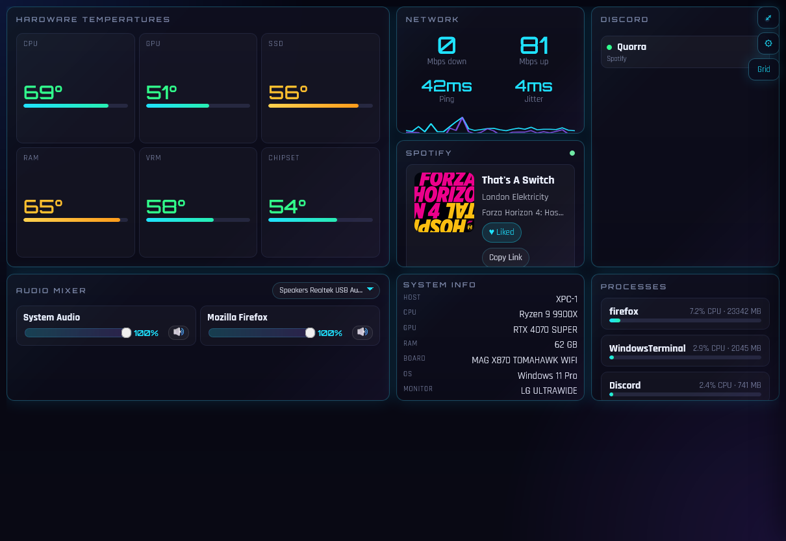

### Phone View

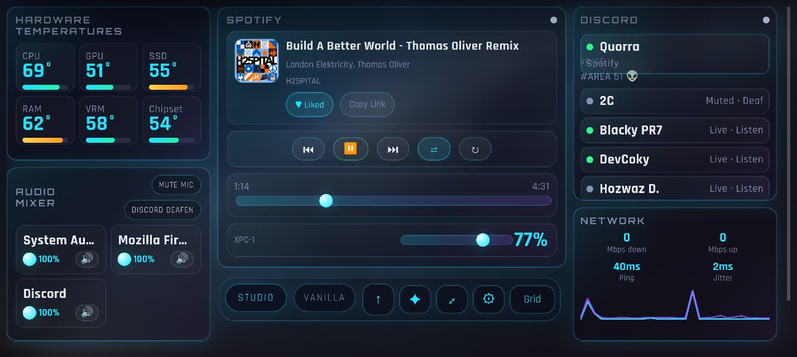

## Clients

- `/studio/`
  - main next-gen client
  - layout editing
  - viewport-specific presets
  - themes, media backgrounds, Pexels, typography editing
- `/vanilla/`
  - dependency-light fallback
  - simpler and lower-risk runtime path
- `/studio-legacy/`
  - legacy checkpoint route kept for recovery/debugging

## Features

- HWiNFO shared-memory temperature integration
- Windows Core Audio mixer with multi-device app selection
- Discord relay integration with hosted bot token
- Spotify playback and control panel
- local and Pexels-powered background media
- viewport-specific Studio layouts and theme variants
- on-page typography editing in Studio
- portable Windows package layout with root launchers and runtime files under `app\`

## Projects

- `src/Monitor.Server`
  - Windows-only local dashboard server
  - reads HWiNFO, Core Audio, WMI, processes, and network telemetry from the gaming PC
  - serves the browser UI
- `src/Monitor.DiscordRelay`
  - hosted Discord companion service
  - keeps the Discord bot token off the gaming PC
  - connects to Discord once and exposes a small HTTP API the dashboard can poll
- `src/StudioClient`
  - Svelte Studio frontend source

## Architecture

- `Monitor.Server` stays on the Windows host PC
- `Monitor.DiscordRelay` runs on an always-on Linux host
- the browser only talks to `Monitor.Server`
- `Monitor.Server` talks server-to-server to the relay for Discord data

## Local Run

```powershell
dotnet run --project .\src\Monitor.Server
```

For LAN access:

```powershell
$env:ASPNETCORE_URLS="http://0.0.0.0:5103"
dotnet run --project .\src\Monitor.Server
```

Then open:

- `http://<pc-lan-ip>:5103/studio/`
- `http://<pc-lan-ip>:5103/vanilla/`

## Portable Build

Build the self-contained Windows package:

```powershell
.\scripts\publish-portable.ps1
```

Output:

- `.\artifacts\publish\win-x64-Release`
- `.\artifacts\gaming-dashboard-win-x64-Release.zip`

Portable layout:

- `Launch Gaming Dashboard.cmd`
- `Launch Gaming Dashboard.ps1`
- `PORTABLE.txt`
- `app\Monitor.Server.exe`
- `app\wwwroot\...`
- other runtime files under `app\`

## User Preferences

User preferences are stored outside the app folder:

```text
%LocalAppData%\GamingDashboard\dashboard.user.json
```

That preserves:

- Studio layouts
- Studio themes and typography
- Discord relay settings
- Spotify auth state
- audio visibility settings

## Studio Theme Media

- `Preview On This PC`
  - instant browser-local preview for the host machine only
- `Save For All Devices`
  - imports the selected media into the app library so phones/tablets can render it too
- `Apply Host File`
  - remote-safe host path linking flow
- local imported media can be removed from the media grid
- Pexels photo/video search is available after saving a Pexels API key

## Discord Relay Setup

The dashboard no longer needs a Discord bot token locally.

Open the dashboard `⚙` drawer and fill the `Discord Relay` section.

Minimum fields:

- `Relay URL`
- `Guild ID`
- `Tracked user ID`

Optional:

- `Relay API key`
- `Messages channel ID`
- `Fallback voice channel ID`
- `Favorite user IDs`

## Relay Configuration

The bot token belongs on the relay host, not on the gaming PC.

Environment variables:

```bash
DiscordRelay__BotToken=your_discord_bot_token
DiscordRelay__ApiKey=shared_dashboard_api_key
DiscordRelay__StartupDelayMs=2500
DiscordRelay__MessageCacheSeconds=4
ASPNETCORE_URLS=http://0.0.0.0:8080
```

Health check:

```bash
curl http://127.0.0.1:8080/health
```

Discord endpoint:

```bash
curl -H "X-Relay-Key: your_api_key" \
  "http://127.0.0.1:8080/api/discord?guildId=123&trackedUserId=456"
```

## Linux Relay Deploy With Podman

SSH in:

```powershell
ssh -i <path-to-private-key> <relay-user>@<relay-host>
```

Clone and build:

```bash
cd /opt
git clone https://github.com/quorraa/gaming-dashboard.git
cd gaming-dashboard/src/Monitor.DiscordRelay
sudo podman build -t gaming-dashboard-relay .
```

Run the relay:

```bash
sudo podman run -d \
  --name gaming-dashboard-relay \
  --restart=always \
  -p 8080:8080 \
  -e ASPNETCORE_URLS=http://0.0.0.0:8080 \
  -e DiscordRelay__BotToken='YOUR_BOT_TOKEN' \
  -e DiscordRelay__ApiKey='YOUR_SHARED_API_KEY' \
  gaming-dashboard-relay
```

## Discord Developer Portal Setup

1. Open https://discord.com/developers/applications
2. Create a new application or open the one you want to use
3. Go to `Bot`
4. Create the bot user if it does not exist yet
5. Copy the bot token and store it only on the relay host
6. Enable:
   - `Server Members`
   - `Presence`
   - `Message Content` only if you want the `Latest` block
7. Invite the bot to your server with permission to view the relevant channels
8. Enable Discord `Developer Mode`
9. Copy the IDs you need into the dashboard

## HWiNFO Setup

Run once after installing HWiNFO:

```powershell
.\scripts\configure-hwinfo-autostart.ps1 -RestartIfRunning
```

The helper enables:

- `SensorsOnly=1`
- `OpenSensors=1`
- `ServerRole=1`
- `SensorsSM=1`
- `MinimalizeSensors=1`
- `MinimalizeMainWnd=1`

## Prerequisites

Prepare a target machine:

```powershell
.\scripts\install-prereqs.ps1
```

It installs HWiNFO if needed and creates the Windows Firewall allow rule for TCP `5103`.

The published Windows package is self-contained, so it does not require a separate .NET install.
